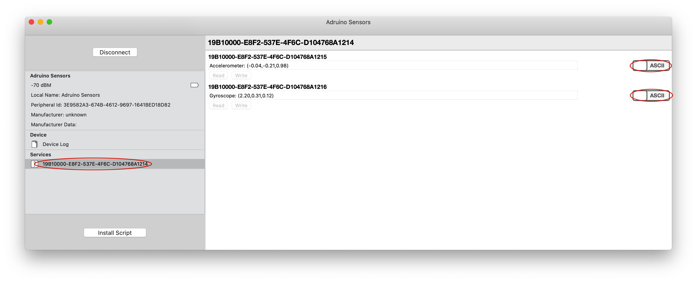
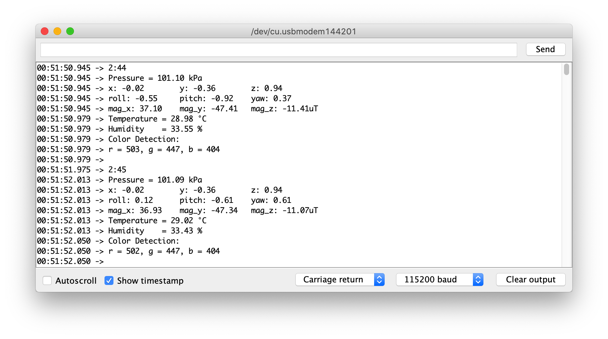
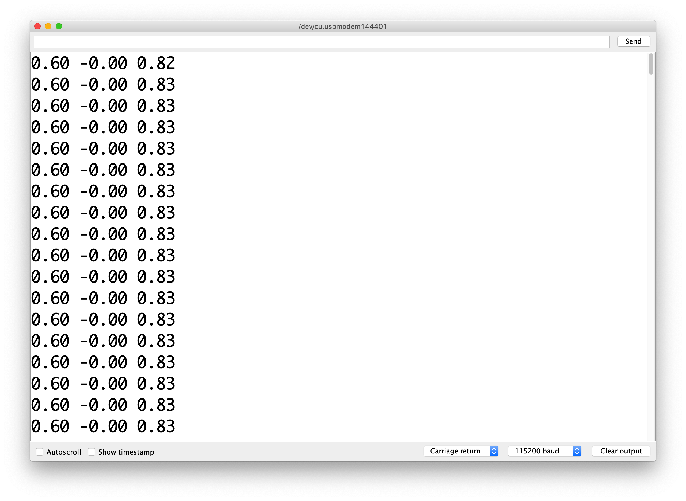
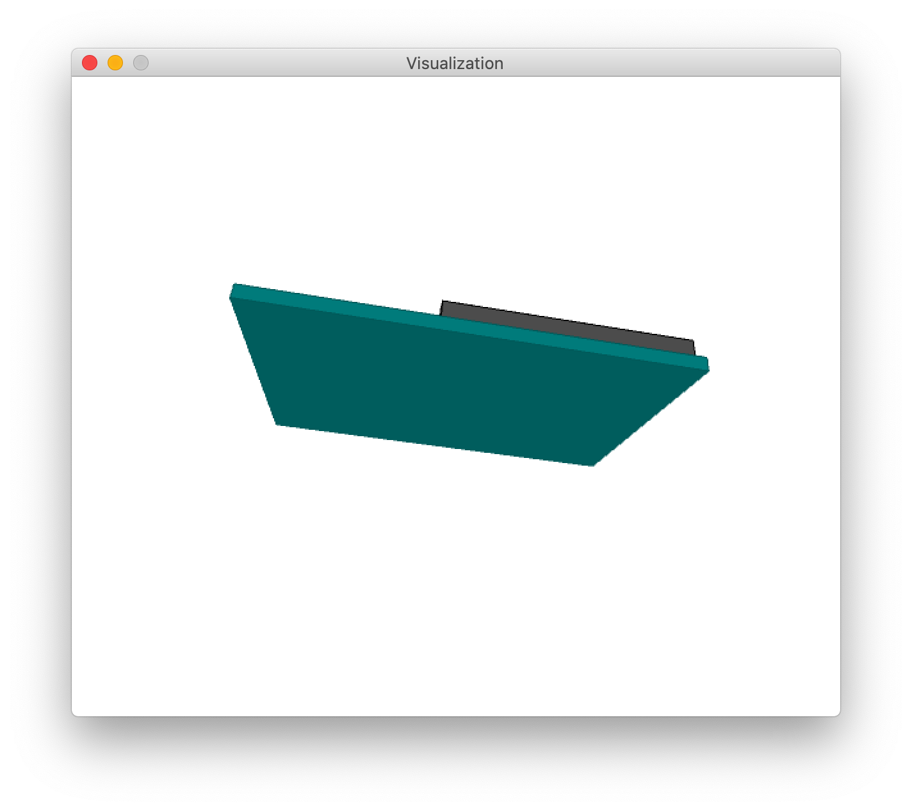
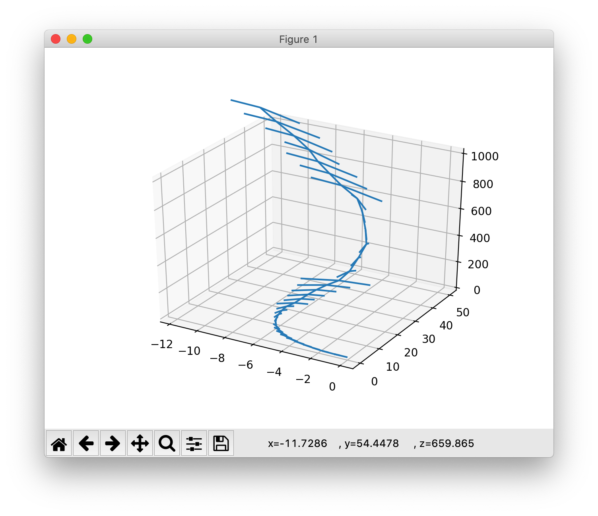

# Human Powered Submarine Autopilot Roll Control Module

Project Statement: Develop an autopilot system that could be implemented to control the roll of the human-powered submarine as it navigates through the water. This system would be composed of a prototype hardware module with a proof-of-concept vehicle orientation display, a data control loop, and the interface between hardware and software.

## Getting Started

These instructions will get you a copy of the project up and running on your local machine.

### Prerequisites

For this project, we chose to use ARDUINO NANO 33 BLE board. For it has multiple sensors to collect various types of data at real time, and then process the data in our control algorithm.

### Installing

First make sure to have `Arduino IDE` and `git` installed on your computer.

* Click [here](https://www.arduino.cc/en/Main/Software) for `Arduino IDE` tutorial.
* Click [here](https://dev.to/landonp1203/how-to-properly-set-up-git-on-your-computer-33eo) for `git` tutorial.


After installing, open a destination folder of where you want to store this project. Then open terminal and input the following code:
```
git clone https://github.com/hps-autopilot/microcontroller.git
```

When you finished, go to hps_capstone folder, hps_auto_pilot, and open up `hps_auto_pilot.ino` file on Arduino software.

In this project, we use some additional Arduino Libraries, which needed to be installed manually.

The Arduino Libraries are:
* Arduino_LSM9DS1
* Arduino_LPS22HB
* Arduino_HTS221
* Arduino_BLE
* Madgwick
* SD (only if you are using SD cards)


Click [here](https://www.arduino.cc/en/guide/libraries) if you need help downloading and installing the libraries on Arduino IDE.  

And if you are planning to use Serial Port Data Visualization version, please following [Processing](https://processing.org/tutorials/gettingstarted/) and [Python](https://www.python.org/about/gettingstarted/) tutorials to install these two components.

Congratulations! You've completed the set up and READY TO ROLL!

## Running the tests

This project is able to output the Arduino sensor data through Bluetooth Low Energy technology or Serial Port. In the `Arduino Code` folder, open the corresponding folder of whichever method you want to use to get the sensor data.
One you opened the `.ino` file, then go to `Tools > Port >` and select the port that Arduino board is connected to. After you finished, you can upload to the Arduino Board by hit the circle with the right arrow on top of the Arduino IDE scree. Or press `cmd+U` for Mac.

### BLE
If you choose to use BLE technology to transmit the sensor data. Please installed [BlueSee](https://apps.apple.com/us/app/bluesee-ble-debugger/id1336679524?mt=12) for MacOS in the App Store.

Once you've successful downloaded `BlueSee` and opened it up. Click the `Scan` button on the top left corner. Then you'd be able to see a `Arduino Sensors` in the `Name` Column. Right click on the Name and click `Connect` to build connection with the Arduino BLE. Then right click again, and click on open, to see the interface of connection. Click on the one service tag, with UUID `19B10000-E8F2-537E-4F6C-D104768A1214`. Then click both `HEX` sliders on the right side, when they turned to `ASCII`, you should be able to see the sensor data in String Characters. Like the example below:


Notes: the BLE+SDCard version is designed for pilot display. Follow the similar procedure as the BLE, but it MUST have a SD Card plug in to the card reader, otherwise the code will not run. And must have the LED Array wired to the board to show the result.

### Serial Port
If you choose to use the Serial Port to received the Arduino sensor data. You can go to `Tools > Serial Monitor`, or `Shift + CMD + M` to open up the serial port screen and see the sensor data. Like the image displayed below.


### Serial Port Visualization
If you choose to use the Serial Port Visualization,  first follow the same procedure as the `Serial Port` instructions to run and upload the code to the board via Serial Port, and then open up Serial Monitor. But it will be like this:

To visualized the real time orientation of the board, open file  `Visualization.pde` in `Processing` in the `Visualization` folder. And change the serial port setting between line 12-18 based on your computer OS. Then hit `RUN` button on the upper left corner. You should be able to see a pop-up task like this:

If you want to visualized the displacement data collected by the device, open up `Serial Monitor` again and copy and paste the output data values to `displacement_sample.txt` located in `Python Graph` folder. (Overwrite the old values) And then run Python script in terminal in the same folder.
```
python displacement_vector.py
```
You will get something like this:



## Deployment

The demo is shown in MacOS with Arduino IDE. Individual research on other OS is recommended.

## Authors

* **Karine Chen** - *Control System*
* **Chase Hunter** - *Hardware*
* **John Chen** - *Software*

## Acknowledgments

* Advisor: Professor Sam Burden
* Industry Mentor: Eric Jones, Joseph Reck, Nick Valladarez
* Sponsor: BOOZ ALLEN HAMILTION
* Thanks to Nikolas Johnson and Jack Ryan from the UW HPS team
* Special thanks to Booz Allen Hamilton for sponsoring our capstone project!
